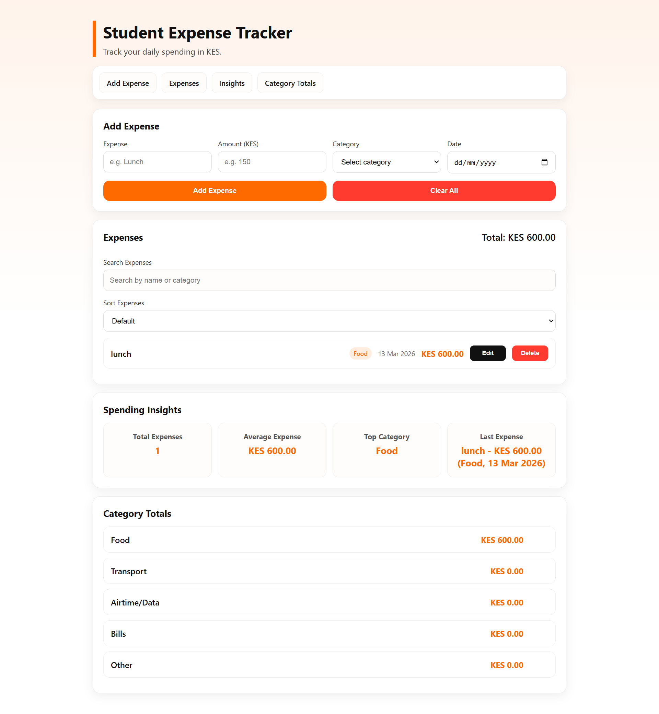

# 📊 Student Expense Tracker

A modern JavaScript web application for tracking and analyzing daily expenses.  
The app allows users to manage spending, analyze categories, and maintain persistent data directly in the browser.

- day 10,11

---

# 🚀 Live Demo
https://victormukumbu.github.io/student-expense-tracker
---

# 📸 Screenshots
- 
- 

---

# ✨ Features

## Expense Management

- Add expenses with **name, amount, category, and date**
- Edit expenses safely using an **editing state**
- Delete individual expenses
- Clear all expenses instantly

## Financial Insights

- Automatic **total spending calculation**
- **Totals per category**
  - Food
  - Transport
  - Airtime/Data
  - Bills
  - Other
- Spending **insights dashboard**

## Data Persistence

- Uses **Local Storage** so data remains saved even after refreshing the page

## Data Organization

- **Search and filtering** to quickly locate expenses
- **Sorting options** for better analysis

Sorting options include:

- Name
- Amount (Low → High)
- Amount (High → Low)
- Category

## User Experience Improvements

- Safe editing workflow that prevents accidental data loss
- Smart empty-state messages
- Robust date formatting validation
- Consistent UI rendering flow

## Interface & Navigation

- **Responsive layout** for mobile and desktop devices
- **Sticky section navigation**
- Active section highlighting while scrolling

---

# 🧠 Technologies Used

- HTML5
- CSS3
- JavaScript (Vanilla)
- LocalStorage API

No frameworks were used.  
The project focuses on **core JavaScript and DOM manipulation**.

---

# 🏗 Application Architecture

The application follows a structured UI rendering approach:

User Action  
↓  
Update Data  
↓  
Save to Local Storage  
↓  
Recalculate Totals  
↓  
Render UI

This ensures the interface always reflects the current application state.

---

# 📚 What I Learned

While building this project I practiced:

- DOM manipulation
- Event-driven UI updates
- Data structures using arrays and objects
- Local Storage persistence
- Filtering and sorting algorithms
- Safe editing workflows
- UI rendering patterns
- Responsive interface design
- User experience improvements

---

# 🔮 Future Improvements

Planned upgrades include:

- Spending charts and data visualization
- Export expenses to CSV / JSON
- Dark mode support
- Backend database integration
- User authentication

---

# 📌 Project Purpose

This project was built as part of a **public learning journey into software development**, documenting the process of building a real application step by step.

---

# 👨‍💻 Author

Victor (Software) Mukumbu

---

# 📜 License

MIT License